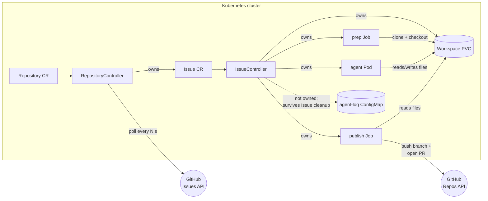
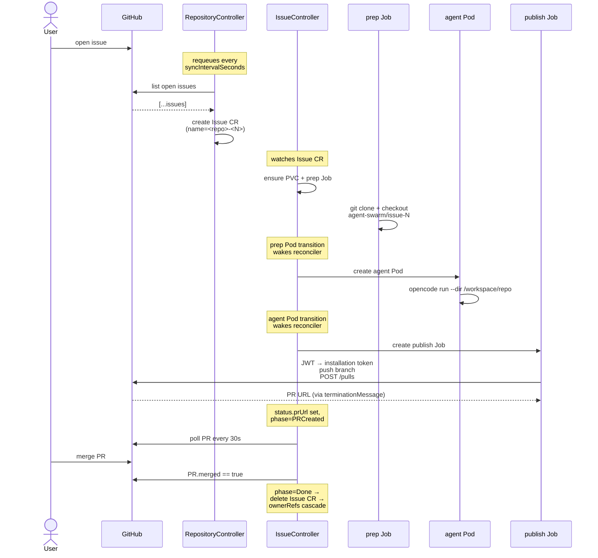
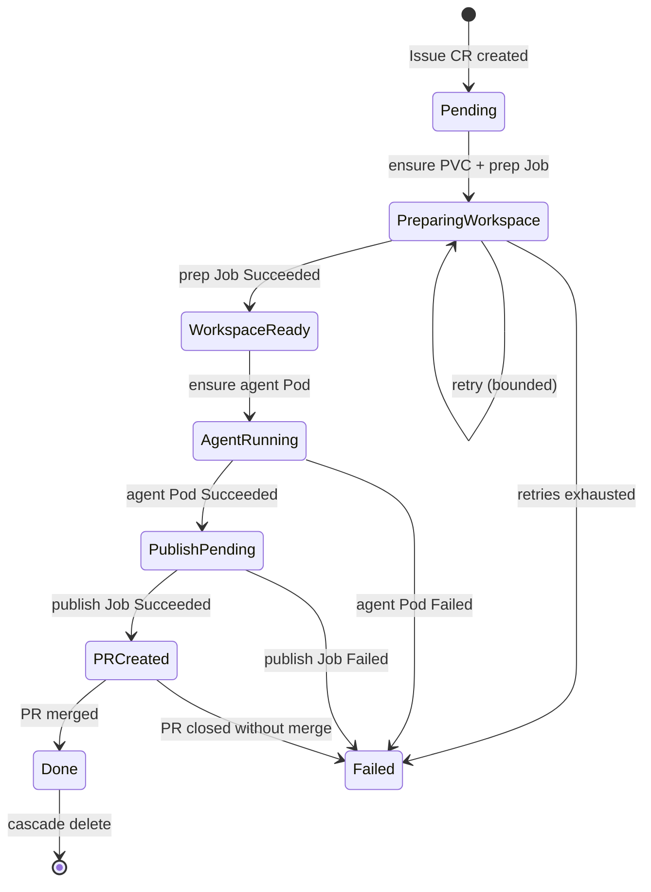

# operator

Kubernetes operator that turns GitHub issues into agent-attempted pull requests.

This README is for someone reading the operator code. For project-wide context (collaboration mode, scope, conventions) see [`../CLAUDE.md`](../CLAUDE.md). For kubebuilder mechanics (scaffolding markers, codegen rules) see [`AGENTS.md`](AGENTS.md).

## What it does

Two custom resources, two controllers, one binary:

- **`Repository`** declares a GitHub repo to watch. `RepositoryController` polls it every `spec.syncIntervalSeconds` and reflects the open issues as child `Issue` CRs in the cluster.
- **`Issue`** is a read-only mirror of one GitHub issue. `IssueController` drives each one through a phase machine that materializes a workspace, runs an agent against it, opens a pull request, and waits for the PR to merge before cleaning up.

Single operator binary in `cmd/main.go` hosts both controllers. Single Deployment. Polling is the only trigger from GitHub; webhook support is intentionally out of scope (see [`../CLAUDE.md`](../CLAUDE.md) → Scope).

## Architecture



### Credential boundary

The agent Pod and the publisher Pod are deliberately separate processes with different credentials:

| Pod               | Has                                              | Can do                                        |
| ----------------- | ------------------------------------------------ | --------------------------------------------- |
| `agent-<issue>`   | OpenCode API key + workspace volume              | Run LLM, write files to workspace             |
| `publish-<issue>` | GitHub App `appId`/`installationId`/`privateKey` | Sign installation token, push branch, open PR |

The agent has no GitHub token. If the LLM goes off-script the workspace gets dirty, but nothing leaves the cluster. The publisher is a fixed bash script with no agent-supplied inputs (only operator-supplied env vars) — its only input from the agent is "whatever files are in the workspace." Humans review the PR before merge.

See the file header of [`internal/controller/issue_controller_publish.go`](internal/controller/issue_controller_publish.go) for the full design note.

## Trigger model

Two things wake the controllers:

1. **Polling.** `RepositoryController` requeues itself every `Repository.spec.syncIntervalSeconds` to hit the GitHub Issues API. This is the only path from "an upstream change happened on GitHub" to "the cluster reflects it." Webhooks would shorten this loop but are intentionally out of scope.
2. **Watches.** `IssueController.SetupWithManager` calls `Owns(Job, Pod)`. Status changes on owned Jobs/Pods produce events that wake the reconciler — so when the prep Job finishes, the controller is poked immediately rather than discovering it on the next poll.

### End-to-end sequence



### Phase machine

The `Issue` CR walks a fixed set of phases. Any phase can land in `Failed`; terminal success is `Done`.



The phase ↔ handler map lives at the top of [`internal/controller/issue_controller.go`](internal/controller/issue_controller.go). Each phase is owned by a single function in a single file; the dispatcher in `Reconcile` is the only place that decides which one runs.

## File layout

```
operator/
├── cmd/main.go                       # manager binary entrypoint, env var resolution
├── api/v1alpha1/                     # CRD Go types (Repository, Issue)
├── internal/
│   ├── controller/                   # reconcilers
│   │   ├── repository_controller.go             # poll loop
│   │   ├── repository_controller_issue_sync.go  # Issue CR diffing
│   │   ├── repository_controller_status.go      # Synced=False writer
│   │   ├── issue_controller.go                  # phase dispatcher + workspace prep
│   │   ├── issue_controller_workspace.go        # PVC + prep Job builders
│   │   ├── issue_controller_agent.go            # agent Pod + log archival
│   │   ├── issue_controller_publish.go          # publisher Job (credential boundary)
│   │   ├── issue_controller_pr.go               # PR-merge polling
│   │   ├── issue_controller_status.go           # status write helpers
│   │   └── credentials.go                       # GitHub App secret loader (shared)
│   └── github/                       # narrow GitHub adapter (ghinstallation + go-github)
├── config/                           # kustomize tree (manager, RBAC, CRDs, samples)
├── Dockerfile                        # distroless static, non-root
├── PROJECT                           # kubebuilder source of truth (do not hand-edit)
└── AGENTS.md                         # kubebuilder operational reference
```

## Configuration knobs

| Knob                                  | Where                                              | Purpose                                                                                                                                                   |
| ------------------------------------- | -------------------------------------------------- | --------------------------------------------------------------------------------------------------------------------------------------------------------- |
| `AGENT_IMAGE`                         | env on manager Pod (`config/manager/manager.yaml`) | Override the per-issue agent Pod image. Falls back to `controller.DefaultAgentImage` (minikube path) when unset.                                          |
| `Repository.spec.syncIntervalSeconds` | CR                                                 | How often `RepositoryController` polls GitHub. Minimum 30s.                                                                                               |
| `Repository.spec.secretRef.name`      | CR                                                 | Name of the Secret carrying GitHub App credentials. Same Secret is read by both `RepositoryController` (issue listing) and the publisher Pod (push + PR). |

## Development

Run from `operator/` for code-level iteration:

| Command                           | What it does                                                   |
| --------------------------------- | -------------------------------------------------------------- |
| `make manifests`                  | Regenerate CRD YAML and RBAC from `+kubebuilder:` markers      |
| `make generate`                   | Regenerate `zz_generated.deepcopy.go`                          |
| `make fmt vet`                    | Format + static check                                          |
| `make lint` / `make lint-fix`     | golangci-lint (config at `.golangci.yml`)                      |
| `make build`                      | Build the manager binary to `bin/manager`                      |
| `make run`                        | Run the manager directly against the active kubeconfig         |
| `make docker-build IMG=...`       | Build the manager container image                              |
| `make install` / `make uninstall` | Apply or remove CRDs                                           |
| `make deploy` / `make undeploy`   | Apply or remove the full operator (kustomize `config/default`) |

The top-level [`../Makefile`](../Makefile) wraps these with the right `IMG=` values for the in-tree minikube setup (`make redeploy`, `make setup`, `make cluster-clean`). Use the wrapper for routine deploy churn; the operator-local `make` is what you reach for when iterating without redeploying.

## See also

- [`../CLAUDE.md`](../CLAUDE.md) — phase tracker, collaboration mode, scope guardrails
- [`AGENTS.md`](AGENTS.md) — kubebuilder operational reference (codegen, markers, distribution)
- [`../README.md`](../README.md) — top-level repo orientation
- [Kubebuilder Book](https://book.kubebuilder.io/) — upstream docs
